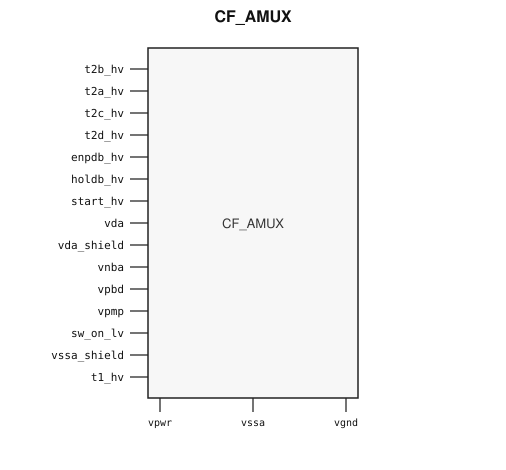

# CF_AMUX

> Analog Mux / Switch

Draft for designer review. The public GDS is an abstract; ChipFoundry
substitutes protected full geometry at tapeout.

This package ships an SRAM-style PG wrap `CF_AMUX` around analog leaf
`CF_AMUX_core`.

## Overview

`CF_AMUX` is a SkyWater 130 nm hard-macro analog switch for configurable
multi-channel routing. Instantiate `CF_AMUX`.

Macro size is 59.37 × 78.46 µm (15 µm halo around analog leaf
29.37 × 48.46 µm). Customer PG for chip PDN is `vpwr` / `vgnd` (vendor
digital `vpwrd` / `vssd`). Analog supplies `vda` / `vssa` / `vpmp` and
shields stay wrap ports and are routed as signals.

## Installation

```bash
pip install cf-ipm
ipm install CF_AMUX --version 0.2.0 --include-drafts
```

Until the marketplace listing is published, install from a local catalog
override:

```bash
ipm install CF_AMUX --version 0.2.0 --include-drafts --local-file ip/catalog.json
```

Use `hdl/gl/CF_AMUX.v` as the customer blackbox, `layout/lef/CF_AMUX.lef`
for P&R, and `layout/gds/CF_AMUX.gds` / `layout/mag/CF_AMUX.mag` for the
public wrap. `CF_AMUX_core` is the analog leaf (empty Verilog, pin-only
abstract). ChipFoundry substitutes vault GDS into `CF_AMUX_core` at tapeout.
P&R uses the wrap LEF (`vpwr` / `vgnd` for chip PDN).

## Features

- Analog terminals `t1_hv` and `t2a_hv` / `t2b_hv` / `t2c_hv` / `t2d_hv`
- Low-voltage switch enable `sw_on_lv`
- High-voltage sequence controls `start_hv` / `holdb_hv` / `enpdb_hv`
- Analog supplies `vda` / `vssa` and pump `vpmp` (wrap signal ports)
- Analog shields `vda_shield` / `vssa_shield` and wells `vnba` / `vpbd`
- Customer cell `CF_AMUX` 59.37 × 78.46 µm (15 µm halo around analog leaf 29.37 × 48.46 µm)
- Chip PDN is `vpwr` / `vgnd`

## Pinout

Customer documentation includes a pinout of the integration cell only.
Internal schematics and architecture block diagrams are not published.



Pin names and directions match the public wrap (`layout/lef/CF_AMUX.lef`)
and the blackbox stub (`hdl/gl/CF_AMUX.v`).

## Pin Description

Directions and widths are taken from the shipped Verilog in `hdl/gl/CF_AMUX.v`.

| Name | Direction | Width | Description |
|---|---|---:|---|
| `t2b_hv` | inout | 1 | Analog switch terminal 2B. |
| `t2a_hv` | inout | 1 | Analog switch terminal 2A. |
| `t2c_hv` | inout | 1 | Analog switch terminal 2C. |
| `t2d_hv` | inout | 1 | Analog switch terminal 2D. |
| `enpdb_hv` | input | 1 | High-voltage path enable (active low). |
| `holdb_hv` | input | 1 | High-voltage hold (active low). |
| `start_hv` | input | 1 | High-voltage start. |
| `vda` | input | 1 | Analog supply. Route as a signal; not on chip PDN. |
| `vda_shield` | input | 1 | Analog supply shield. Route as a signal; not on chip PDN. |
| `vnba` | input | 1 | Analog n-well tap. Route as a signal; not on chip PDN. |
| `vpbd` | input | 1 | Analog p-well tap. Route as a signal; not on chip PDN. |
| `vpmp` | input | 1 | Analog pump supply. Route as a signal; not on chip PDN. |
| `vssa` | input | 1 | Analog ground. Route as a signal; not on chip PDN. |
| `sw_on_lv` | input | 1 | Low-voltage switch enable. |
| `vssa_shield` | input | 1 | Analog ground shield. Route as a signal; not on chip PDN. |
| `t1_hv` | inout | 1 | Analog switch terminal 1. |
| `vpwr` | input | 1 | Digital supply. |
| `vgnd` | input | 1 | Ground. |

`CF_AMUX_core` also has vendor digital `vpwrd` / `vssd`. The wrap ties
`.vpwrd(vpwr)` and `.vssd(vgnd)`. Do not connect those pins at chip level.

In OpenLane / LibreLane, hook chip PDN with
`PDN_MACRO_CONNECTIONS: "u_cf_amux vccd1 vssd1 vpwr vgnd"` and connect
`.vpwr(vccd1)`, `.vgnd(vssd1)` under `USE_POWER_PINS`. Do not list `vpwrd`
/ `vssd` on the wrapper instance. Route analog terminals and analog
supplies onto `analog_io`.

## Limitations and Open Issues

- Verilog in `hdl/gl/CF_AMUX.v` is a structural wrap around an empty
  `CF_AMUX_core` blackbox, not a SPICE-accurate model.
- Liberty is not in this first wrap drop. P&R uses the wrap LEF.
- Companion GPIO / SIO / VIO pad assemblies stay foundry-only. This
  package ships the working analog-switch integration cell.
